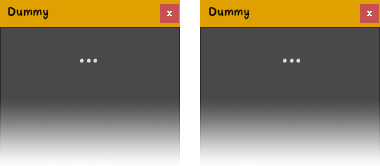

<!--{}-->
<table id='top' width='100%' border='0'>
    <tr>
        <td align='center' valign='middle' width='96'>
            <picture>
                <source media='(prefers-color-scheme: dark)' srcset='assets/icon_dark.png'>
                <source media='(prefers-color-scheme: light)' srcset='assets/icon_light.png'>
                
            </picture>
        </td>
        <td align='right' valign='middle' width='916' nowrap>
             
             
             
        </td>
    </tr>
</table>
<!--{}-->

# LS Dummy Script

A dummy script/placeholder just for the sake of testing different parts of the READMEs and Lost Script™ webpage. Nothing to do here...

 

## Gallery

<strong>UI</strong> (Expand/Collapse)  

 

<table align="center" border="0" class="gallery"><tr>
<td width="178" valign="top"><!-- width="1024px" for full width container-->

</td><td width="178" valign="top">

</td><td width="178" valign="top">
</td>
</tr></table>

 

## Features

- Feature 1
- Feature 2
- Feature 3

 

## Installation

[**Download**][h-shield1-a] the file, **unzip** it, and proceed with the installation method of your choice...

| MANUAL                                                                           | ASSISTED                                                                         |
| -------------------------------------------------------------------------------- | -------------------------------------------------------------------------------- |
| 1. You'll get some of these folders:  `Menu / ScriptResources / Tool / Utility`  | 1. In Moho®, go to "Scripts > Install Script…" to open the installation wizard*  |
| 2. Place'em all into the *Scripts* folder of your [Custom Content Folder][3-1a]  | 2. Click *Select A Script Folder*, browse to the unzipped folder & **select it** |
| 3. Restart Moho or press `Alt + Shift + Ctrl + L` to *Reload Tools And Brushes*  | *  More details in chapter [23.17 Install Script…][3-2a] of Moho® user's manual  |

And that's all! The script should appear in *Tools* palette and/or under *Scripts* menu.

> ⚠ **WARNING:** Please, make sure you have uninstalled every Lost Script on your system before removing any of these shared resources or they may start throwing errors or stop working. For uninstalling a script, just remove any file and folder matching its name and restart Moho® or Reload Tools And Brushes if necessary.

 

## Usage

1. **Opening**: Open *Dummy Script* from Moho's *Tools* palette or via its entry in the *Scripts* menu.
2. **Operating**: Now you can have it permanently open to perform various operations.
3. **Customizing**: Unfold Window's main menu: 🔽 (at top left of the window) to access different settings & actions.
4. **Tooltips**: If *Beginners Mode* is checked, holding the cursor over the different elements will give a hint of their functionality...

 

## Collab & Support

Suggestions and bugs can be reported in the [<i>Issues</i>](https://github.com/lost-scripts/ls_dummy/issues "Go to ''Issues'' section") section (preferably) or in the corresponding topic, if any, in [<i>Scripting</i>](https://www.lostmarble.net/forum/viewforum.php?f=12 "Go to Lost Marble Forum's ''Scripting'' section") section of the [<i>Lost Marble Forum</i>](https://www.lostmarble.net/forum "Go to the ''Lost Marble Forum''").

 

## Other...

- <a href="https://lost-scripts.github.io/scripts/ls_dummy" data-alt-href="https://github.com/lost-scripts/ls_dummy" data-alt-textContent="Dummy window repository" data-alt-title="Go to the Dummy Script repository...">Dummy Script webpage</a>
- [Lost Marble Forum topics](https://lostmarble.net/forum/search.php?author_id=88&sr=posts "Go to my Lost Marble Forum topics...")

---

[h-shield1-i]: https://img.shields.io/github/downloads/lost-scripts/ls_dummy/total?logo=data:image/svg%2bxml;base64,PHN2ZyB4bWxucz0iaHR0cDovL3d3dy53My5vcmcvMjAwMC9zdmciIHZpZXdCb3g9IjAgMCA1MTIgNTEyIj48cGF0aCBmaWxsPSIjZWVlIiBkPSJNMjg4IDMyYTMyIDMyIDAgMSAwLTY0IDB2MjQzbC03My03NGEzMiAzMiAwIDAgMC00NiA0NmwxMjggMTI4YzEzIDEyIDMzIDEyIDQ2IDBsMTI4LTEyOGEzMiAzMiAwIDAgMC00Ni00NmwtNzMgNzRWMzJ6TTY0IDM1MmMtMzUgMC02NCAyOS02NCA2NHYzMmMwIDM1IDI5IDY0IDY0IDY0aDM4NGMzNSAwIDY0LTI5IDY0LTY0di0zMmMwLTM1LTI5LTY0LTY0LTY0SDM0N2wtNDYgNDVhNjQgNjQgMCAwIDEtOTAgMGwtNDUtNDVINjR6bTM2OCA1NmEyNCAyNCAwIDEgMSAwIDQ4IDI0IDI0IDAgMSAxIDAtNDh6Ii8+PC9zdmc+&color=blue
[h-shield1-a]: https://github.com/lost-scripts/ls_dummy/releases/latest/download/ls_dummy.zip "Download latest version..."

[h-shield2-i]: https://img.shields.io/github/release/lost-scripts/ls_dummy?logo=github
[h-shield2-a]: https://github.com/lost-scripts/ls_dummy/releases/latest "Go to release in GitHub..."

[h-shield3-i]: https://img.shields.io/badge/for-Moho_Pro_14.3+_(Win)-orange
[h-shield3-a]: https://moho.lostmarble.com/ "Go to Moho® website..."

[3-1a]: https://manual.lostmarble.com/app/page/1bmBks7y8KPdbPd-ll9kQGPdZJfDf3Rq67BCp8F5Y-FI?p=1UxA8Gi5DttJku9AmFlSpO0gJw4U9flX3
[3-2a]: https://manual.lostmarble.com/app/page/1IOuEOfMa7kUwqYPi2ABDhwoWE_KXB1OBCC5ib__iyIE?p=1UxA8Gi5DttJku9AmFlSpO0gJw4U9flX3
