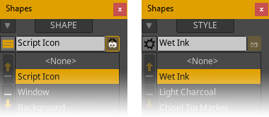
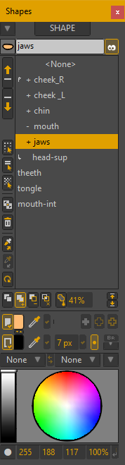
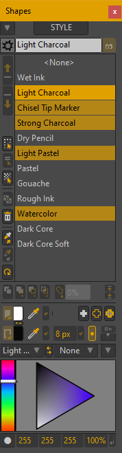
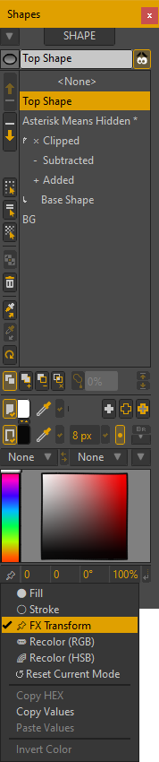
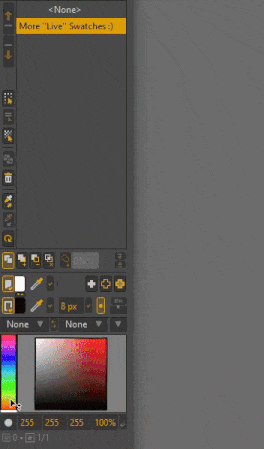
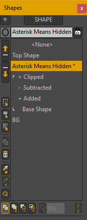

<table width="100%" border="0"><tr><td align="left" valign="middle" width="96">

</td><td align="right" valign="middle" width="1920" nowrap>

[![h-shield1-i]][h-shield1-a] [![h-shield2-i]][h-shield2-a] [![h-shield3-i]][h-shield3-a]
</td></tr></table>

# LS Shapes Window

Persistent shape palette plus helpers for better management of Moho® vectors in general and *Liquid Shapes* in particular. This script provides a visual and user-friendly interface for performing complex shape operations effortlessly.

 

## Gallery

	

		&ensp;&ensp;
	

	 
	<table align="center" border="0" class="gallery">
		<tr>
			<td nowrap><!-- width="1024px" for full width container-->
				&ensp;
				&ensp;
				&ensp;
				&ensp;
				
				 
			</td>
		</tr>
	</table>

 

## Features

- Visualize layers' shape relationships at a glance.
- Take the most of *Liquid Shapes* thanks to improved management.
- Rename, reorder, hide/show, etc. one or several shapes with ease.
- New ways of shape creation independently of selected tool.
- Shape selection helpers: Select all, Inverse, Similar, Identical...
- Improved *Style* management, picking and modification.
- Many interactive "live" Swatches (and you can easily make your own).
- Recoloring features plus other helpers.
- Several window display modes to better suit your needs.
- And... much more!

 

## Installation

[**Download**][h-shield1-a] the file, unzip it, and proceed with the installation method of your choice...

| MANUAL                        | ASSISTED                      |
| ----------------------------- | ----------------------------- |
| 1. You'll get one or more of the following folders: `Menu / ScriptResources / Tool / Utility`.           | 1. From Moho's main menus, go to "Scripts -> Install Script..." and a window with some info will appear.           | 
| 2. Drag & Drop (or Copy & Paste) them all into the Scripts folder of your [Custom Content Folder][3-1a]. | 2. Press *Select A Script Folder* button, browse to the just uzipped folder (e.g. ls_shapes_window) and select it. |
| 3. Restart Moho® or press `Alt + Shift + Ctrl + L` to *Reload Tools And Brushes* and the script should appear in *Tools* palette and/or under *Scripts* menu.   | 3. That done, the script should appear in *Tools* palette and/or under *Scripts* menu. See chapter [23.17 Install Script...][3-2a] of Moho® user's manual for further details.     |

> ⚠ **WARNING:** Please, make sure you have uninstalled every Lost Script on your system before removing any of these shared resources or they may start throwing errors or stop working. For uninstalling a script, just remove any file and folder matching its name and restart Moho® or Reload Tools And Brushes if necessary.

 

## Usage

1. **Opening**: Open *Shapes Window* from Moho's *Tools* palette or via its entry in the *Scripts* menu.
2. **Operating**: Now you can have it permanently open to perform various shape operations.
3. **Customizing**: Unfold Window's main menu: 🔽 (at top left of the window) to access different settings & actions.
4. **Tooltips**: Hold the cursor over the different elements to get a hint of their functionality...

 

## Collab & Support

Suggestions and bugs can be reported in the [<i>Issues</i>](https://github.com/lost-scripts/ls_shapes_window/issues "Go to ''Issues'' section") section (preferably) or in the corresponding topic, if any, in [<i>Scripting</i>](https://www.lostmarble.com/forum/viewforum.php?f=12 "Go to Lost Marble Forum's ''Scripting'' section") section of the [<i>Lost Marble Forum</i>](https://www.lostmarble.com/forum "Go to the ''Lost Marble Forum''").

 

## Other...

- <a href="https://lost-scripts.github.io/scripts/ls_shapes_window" data-alt-href="https://github.com/lost-scripts/ls_shapes_window" data-alt-textContent="Shapes window repository" data-alt-title="Go to the Shapes Window repository...">Shapes Window webpage</a>
- [Lost Marble Forum topic](https://www.lostmarble.com/forum/viewtopic.php?t=36508 "Go to the Lost Marble Forum topic...")

---

[h-shield1-i]: https://img.shields.io/github/downloads/lost-scripts/ls_shapes_window/total?logo=data:image/svg%2bxml;base64,PHN2ZyB4bWxucz0iaHR0cDovL3d3dy53My5vcmcvMjAwMC9zdmciIHZpZXdCb3g9IjAgMCA1MTIgNTEyIj48cGF0aCBmaWxsPSIjZjhmOGY4IiBkPSJNMjg4IDMyYzAtMTcuNy0xNC4zLTMyLTMyLTMycy0zMiAxNC4zLTMyIDMybDAgMjQyLjctNzMuNC03My40Yy0xMi41LTEyLjUtMzIuOC0xMi41LTQ1LjMgMHMtMTIuNSAzMi44IDAgNDUuM2wxMjggMTI4YzEyLjUgMTIuNSAzMi44IDEyLjUgNDUuMyAwbDEyOC0xMjhjMTIuNS0xMi41IDEyLjUtMzIuOCAwLTQ1LjNzLTMyLjgtMTIuNS00NS4zIDBMMjg4IDI3NC43IDI4OCAzMnpNNjQgMzUyYy0zNS4zIDAtNjQgMjguNy02NCA2NGwwIDMyYzAgMzUuMyAyOC43IDY0IDY0IDY0bDM4NCAwYzM1LjMgMCA2NC0yOC43IDY0LTY0bDAtMzJjMC0zNS4zLTI4LjctNjQtNjQtNjRsLTEwMS41IDAtNDUuMyA0NS4zYy0yNSAyNS02NS41IDI1LTkwLjUgMEwxNjUuNSAzNTIgNjQgMzUyem0zNjggNTZhMjQgMjQgMCAxIDEgMCA0OCAyNCAyNCAwIDEgMSAwLTQ4eiIvPjwvc3ZnPg==&color=blue&logoColor=white&logoWidth=24
[h-shield1-a]: https://github.com/lost-scripts/ls_shapes_window/releases/latest/download/ls_shapes_window_v0.3.0-beta3_20240209-0054.zip "Download latest version..."

[h-shield2-i]: https://img.shields.io/github/release/lost-scripts/ls_shapes_window
[h-shield2-a]: https://github.com/lost-scripts/ls_shapes_window/releases/latest "Go to release in GitHub..."

[h-shield3-i]: https://img.shields.io/badge/for-Moho_Pro_14.3+-orange
[h-shield3-a]: https://moho.lostmarble.com/ "Go to Moho® website..."

[3-1a]: https://manual.lostmarble.com/app/page/1bmBks7y8KPdbPd-ll9kQGPdZJfDf3Rq67BCp8F5Y-FI?p=1UxA8Gi5DttJku9AmFlSpO0gJw4U9flX3
[3-2a]: https://manual.lostmarble.com/app/page/1IOuEOfMa7kUwqYPi2ABDhwoWE_KXB1OBCC5ib__iyIE?p=1UxA8Gi5DttJku9AmFlSpO0gJw4U9flX3