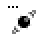

<table width="100%" border="0"><tr><td align="left" valign="middle" width="96">

</td><td align="right" valign="middle" width="1920" nowrap>

[![h-shield1-i]][h-shield1-a] [![h-shield2-i]][h-shield2-a] [![h-shield3-i]][h-shield3-a]
</td></tr></table>

# LS Wiggle Window

This is just a placeholder for the contingent *LS Wiggle Window* homepage.